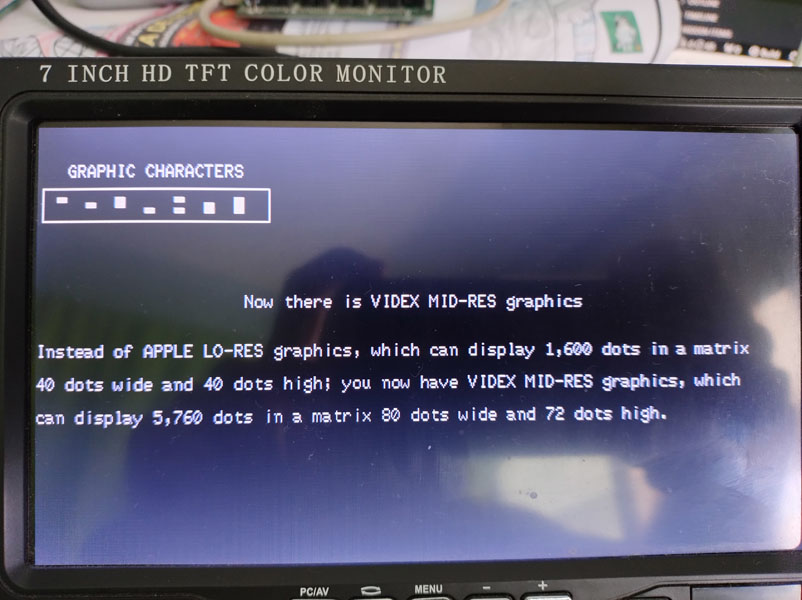
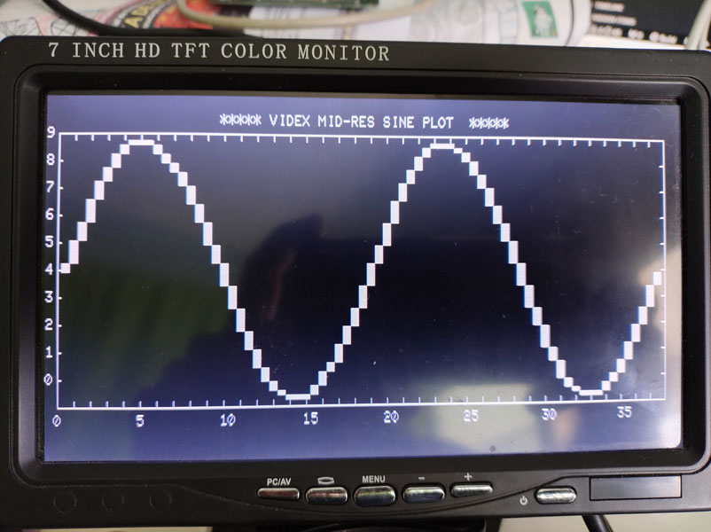
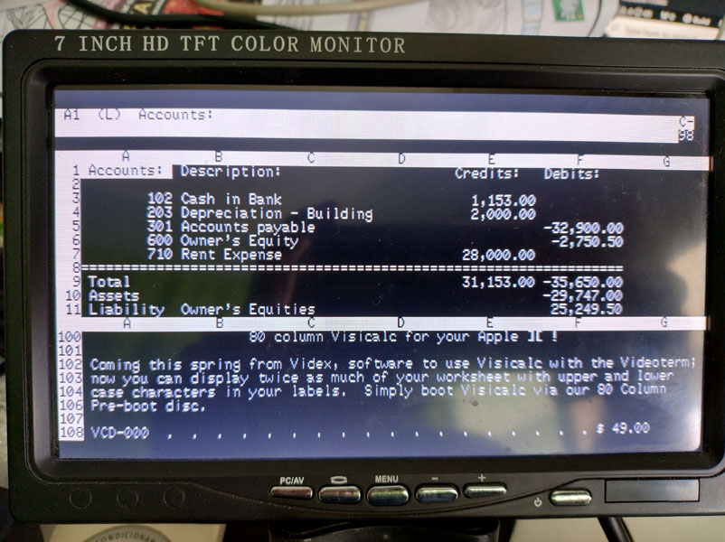

# Apple II VGA Card

This project is a VGA card for Apple II computers to ouput a crisp RGB signal to a
VGA monitor instead of having to rely on the composite output. This is accomplished
by snooping the 6502 bus and creating a shadow copy of the video memory within a
Raspberry Pi Pico, then processing the raw video memory contents to output a "perfect"
signal.

    +------+                +-----+      +-----------+
    | 6502 |________________| RAM |______| Composite | 
    | CPU  |  System   \    +-----+      | Video Gen |
    +------+   Bus     |                 +-----------+
                       |    +-----------+
                       \____| Raspberry |_________________\
                            |  Pi Pico  |   640x480 VGA   /
                            +-----------+

These features are currently supported:
 * Generates a 640x480@60 VGA signal with 3 bits per color channel using resistor DACs
 * Text mode (monochrome)
 * Lo-res mode with no color fringing between the chunky pixels
 * Hi-res mode with simulated NTSC artifact color
 * Mixed lo-res and hi-res modes with monochrome text and no color fringing
 * Apple IIe video modes: 80-column text, double-lores, & double-hires
   (thanks to @dkgrizzly and @Paco1979)
 * Soft-monochrome mode to force display as if on a monochrome monitor
 * Some Video-7 RGB card extended graphical modes are implemented
 * Compatibility with Videx VideoTerm modes on Apple II+ (thanks to @abaffa)

I had these goals in mind during design:
 * Generate video out to a more modern display - I don't have any old CRTs for
   displaying composite signals any more and composite to HDMI adapters don't work well.
 * Generate crisp video - I wanted "perfect" video output, the way that it should have
   been barring technical difficulties of displays in 1980. So like, no NTSC artifact
   coloring where it's not supposed to be.
 * Non-invasive - I didn't want to have to solder or modify my logic board.
 * Common parts - The parts to build should be cheap and easy to get anywhere,
   just like the original Apple II
 * Open-source - If this helps anyone else make their Apple II better then that's
   a bonus.

I also wanted to see if a Pi Pico could actually work on an 8-bit CPU bus, since the docs
say it should work but there were no code examples.

## Project Status

This is currently a DIY project that several folks have built on their own, ranging from
[hand-wired prototype boards](docs/prototype_card.jpg) to
[custom](https://user-images.githubusercontent.com/7944844/243266290-d05ce815-0a3d-4464-a4da-49dd44d71e92.jpg)
[PCBs](https://user-images.githubusercontent.com/94628/253134471-0d5ad359-75ae-400a-acfa-885c80c36e78.jpg)
and run in their Apple II+'s and IIe's. I consider it to be pretty stable at this point.

Included in this repo are:
 * The main expansion board [KiCad Project](AppleVGA/), [Schematics](AppleVGA/AppleVGA.pdf),
   [BOM](AppleVGA/AppleVGA_BOM.csv), and [Gerber files](AppleVGA/outputs/)
 * An optional connector board [KiCad Project](AppleVGA-Connector/),
   [Schematics](AppleVGA-Connector/AppleVGA-Connector.pdf),
   [BOM](AppleVGA-Connector/AppleVGA-Connector_BOM.csv),
   and [Gerber files](AppleVGA-Connector/outputs/). (You could also build a custom cable instead)
 * The [source code for the Pi Pico microcontroller](pico/)

If you're going to build a card then check the [assembly guide](docs/Assembly.md) and
[hardware changelog](AppleVGA/CHANGELOG.txt) for important notes.

Many thanks go to the folks in the Discussion area to help push this project forward with bug
fixes & reports, and design ideas!

**Main board**

**Connector board**
_thanks to @swetland for [this idea](https://github.com/markadev/AppleII-VGA/discussions/15#discussioncomment-6432841)_

**In the wild**

## Comparisons

Here are a few comparisons of the VGA card output vs composite video through
a cheap composite -> HDMI adapter

**Text**

**Lores**

**Hires**

**DHires**

**80 Columns**

## 80 Column support for the Apple II+

The firmware implements Videx VideoTerm compatibility when there's a VideoTerm card installed
in slot 3. It's not enabled by default but if you have a Videx VideoTerm card in slot 3
then you can enable 80 column VGA support using the Configuration Disk image. The VGA card
can still be installed in any slot.

**Apple II+ running 80 Columns Examples**

## Future work

With the Rev B hardware design, the firmware has access to the Apple bus' SYNC signal
when installed in slot 7. Theoretically the firmware could synchronize the VGA display
scans with the video hardware in the Apple II.

Though possible, it looks like it would be a large overhaul to implement this synchronization
and I've found no real-world use for it so I don't plan on completing this functionality.
